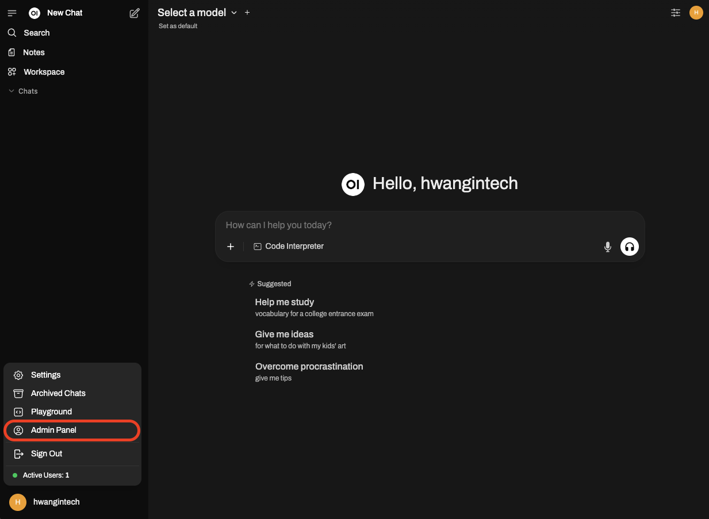
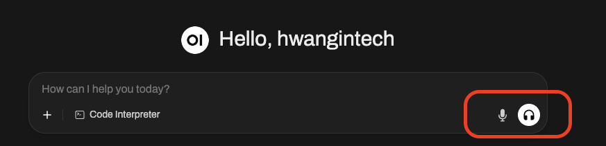
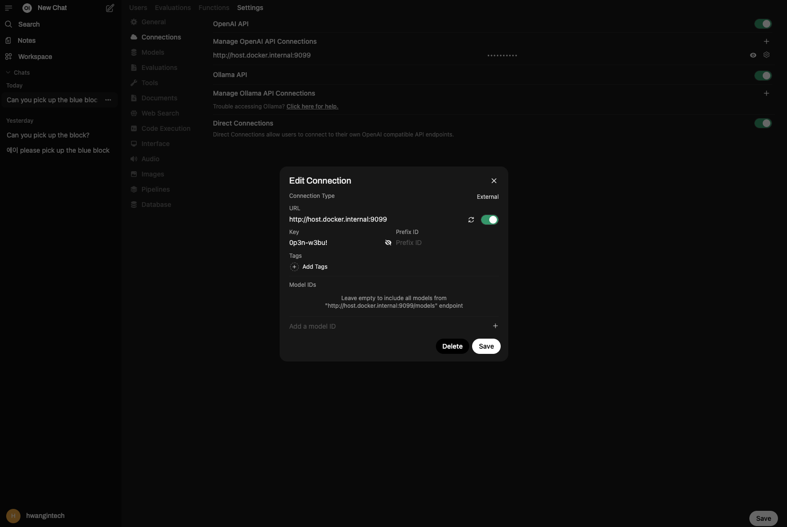

# LeRobot Chat UI

Welcome to LeRobot Chat UI! This project enables seamless interaction with LeRobot through both chat and voice interfaces. The system is designed to work with a robot connected to your local machine (such as a laptop), providing an intuitive way to control and communicate with your robot.

## What You'll Need

Before getting started, make sure you have these components installed:

1. [LeRobot](https://github.com/huggingface/lerobot) - The core robotics framework
2. [uv](https://docs.astral.sh/uv/) - Python package manager for dependency management

## Getting Started

### Step 1: Set Up Open WebUI

**Install and Run Open WebUI**

Start by running Open WebUI using Docker:

```bash
docker run -d -p 3000:8080 --add-host=host.docker.internal:host-gateway -v open-webui:/app/backend/data --name open-webui --restart always ghcr.io/open-webui/open-webui:main
```

**Initial Configuration**

1. Open your browser and navigate to `http://localhost:3000`
2. Create an admin account when prompted
3. You'll then see the main Open WebUI interface

<p align="center">
  
</p>

**Configure Audio Settings**

1. Click on `Admin Panel` in the bottom left corner, then go to `Settings`
2. Open WebUI comes pre-configured with audio functionality for both speech recognition and text-to-speech
3. By default, it uses `faster-whisper` for Speech-to-Text (STT) and `Web API` for Text-to-Speech (TTS)

<p align="center">
    
</p>

Feel free to customize these settings if you prefer different STT/TTS models or APIs.

### Step 2: Install and Configure Pipelines

Pipelines extend Open WebUI's functionality by connecting it to external APIs and services like FastAPI and Ollama.

**Install uv Package Manager**

First, install the uv package manager:

```bash
curl -LsSf https://astral.sh/uv/install.sh | sh
```

**Set Up Dependencies**

Navigate to the pipelines directory and install the required dependencies:

```bash
cd pipelines
uv sync
```

**Customize Your Robot Pipeline**

Now comes the exciting part! You'll need to implement your LeRobot inference logic in `pipelines/lerobot_pipeline.py`. Here's the basic structure:

```python
class Pipeline:
    ...

    def pipe(
        self, user_message: str, model_id: str, messages: List[dict], body: dict
    ) -> Union[str, Generator, Iterator]:
        # This is where you implement your custom LeRobot functionality
        print(f"pipe:{__name__}")

        # TODO: Replace this placeholder with your actual LeRobot inference code
        time.sleep(5)

        yield "Task completed! Is there anything else you'd like me to do?"
```

**Start the Pipeline Server**

Launch your pipeline server:

```bash
bash start.sh
```

### Step 3: Connect the Pipeline to Open WebUI

**Add API Connection**

1. In Open WebUI, go to `Admin Panel` > `Settings` > `Connections`
2. Add your pipeline server as an OpenAI-Compatible API Connection
3. Use the default API key: `0p3n-w3bu!`

<p align="center">
  
</p>

**Automatic Model Discovery**

Once connected, Open WebUI will automatically query your pipeline server and discover the available models, including your "LeRobot" model.

### Step 4: Start Talking to Your Robot!

**Enable Voice Mode**

1. Return to the main Open WebUI page
2. Click on `Voice mode` to enable voice interactions
3. You're now ready to communicate with LeRobot using natural speech!

Simply speak your commands, and LeRobot will respond through both text and voice, creating a natural conversational experience with your robot.

## License

1. This repository is licensed under the MIT License.
2. This repository contains the souce code of [Pipelines](https://github.com/open-webui/pipelines) which is licensed under the MIT License.